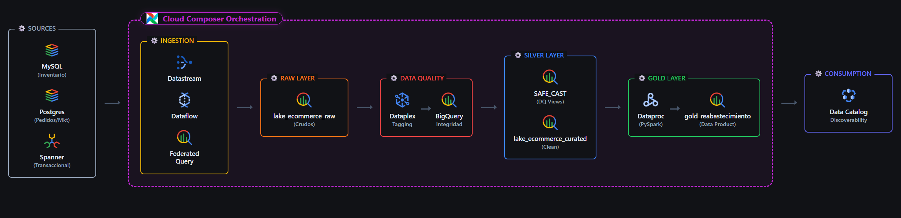
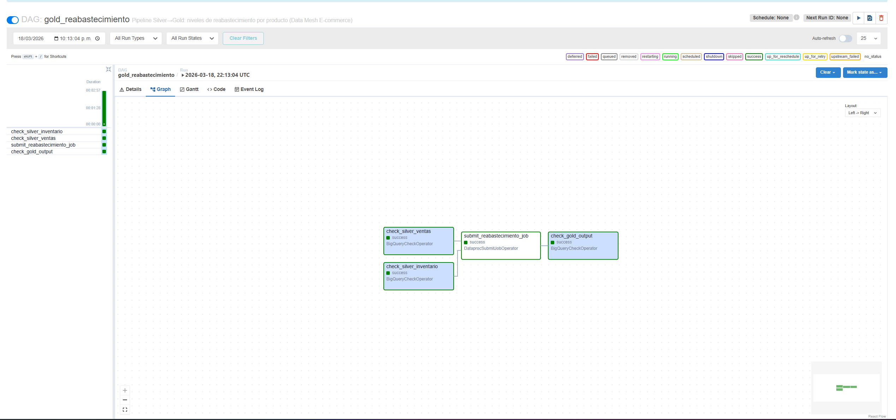
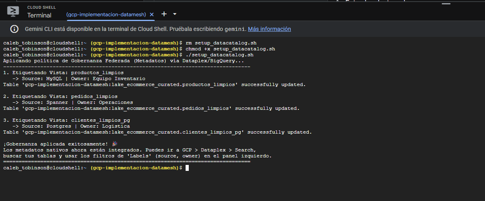

# Implementación de un Data Mesh para una Plataforma de E-commerce en GCP 🌐


Este proyecto despliega una arquitectura analítica moderna basada en el paradigma de **Data Mesh** utilizando los servicios de Google Cloud Platform (GCP). Su objetivo principal es descentralizar la propiedad de los datos hacia dominios de negocio específicos (Inventario, Logística, Operaciones), manteniendo un catálogo gobernado y una infraestructura como código (IaC) de autoservicio.



## 🏢 Arquitectura por Dominios

El proyecto divide la plataforma de comercio electrónico en tres dominios clave, cada uno con su propia base de datos operativa y su representación en la capa analítica de BigQuery:

1. **📦 Dominio de Inventario**
   - **Fuente:** `MySQL` (Cloud SQL)
   - **Ingesta:** CDC continuo mediante Datastream hacia la capa Raw de BigQuery.
   - **Silver:** Vista `productos_limpios`.
2. **🚚 Dominio de Pedidos / Logística**
   - **Fuente:** `PostgreSQL` (Cloud SQL)
   - **Ingesta:** Consultas federadas (sin movimiento de datos) a través de conexiones externas `EXTERNAL_QUERY`.
   - **Silver:** Vistas `clientes_limpios_pg`, `resenas_limpias`, `geolocalizacion_limpia`.
3. **💳 Dominio Transaccional / Operaciones**
   - **Fuente:** `Cloud Spanner`
   - **Ingesta:** CDC mediante job batch de Dataflow hacia BigQuery, y consultas federadas directas para vistas validadas.
   - **Silver:** Vistas `items_pedidos_limpios`, `pagos_limpios`, `pedidos_limpios`.

## 🛠️ Stack Tecnológico

- **Computo & Orquestación:** Dataproc (PySpark), Cloud Composer (Apache Airflow), Dataflow.
- **Almacenamiento & Analítica:** BigQuery (Arquitectura Medallón: Raw, Silver, Gold), Cloud Storage.
- **Bases de Datos Operacionales:** Cloud SQL (MySQL, PostgreSQL), Cloud Spanner.
- **Gobernanza & Calidad:** Dataplex (Data Catalog, Auto DQ), Great Expectations.
- **Infraestructura como Código:** Terraform (Módulos reutilizables).

## 🚀 Características Clave

### 1. Arquitectura Medallón Distribuida
-   **Capa Raw:** Recepción de datos crudos vía Datastream/Dataflow manteniendo el esquema original.
-   **Capa Silver (Curated):** Limpieza, casteo de tipos numéricos/fechas (`SAFE_CAST`, `SAFE.PARSE_TIMESTAMP`) y vistas estandarizadas mediante consultas federadas (PostgreSQL/Spanner).
-   **Capa Gold:** Agregaciones avanzadas mediante trabajos distribuidos de PySpark en Dataproc. Ej: Niveles de reabastecimiento diario (`gold_reabastecimiento`).

### 2. Autoservicio de Infraestructura (Terraform)
Se diseñaron módulos de Terraform en la carpeta `/terraform/modules` que permiten a cualquier nuevo dominio instanciar su infraestructura con mínimo esfuerzo:
-   `dominio_cloudsql`: Levanta PostgreSQL/MySQL.
-   `dominio_bigquery`: Crea datasets Raw y Curated etiquetados.
-   `dominio_iam`: Define Service Accounts con acceso de mínimo privilegio.

### 3. Orquestación con Apache Airflow (Capa Gold)
Un DAG diario en **Cloud Composer** orquesta el movimiento de datos Silver → Gold:
1.  `BigQueryCheckOperator`: Verifica que el inventario y las ventas Silver estén disponibles.
2.  `DataprocSubmitJobOperator`: Dispara un cluster efímero de Dataproc ejecutando **PySpark** para calcular los niveles de reabastecimiento cruzando ambos dominios.
3.  `BigQueryCheckOperator`: Valida que la tabla Gold haya recibido los registros agregados correctamente.



### 4. Gobernanza y Calidad de Datos (Fase 5)
Implementamos el pilar de **Gobernanza Computacional Federada**:
-   **Data Catalog (Dataplex Tags / BigQuery Labels):** Todo el entorno analítico fue etiquetado automáticamente con metadatos (`source: mysql`, `owner: operaciones`) usando un script unificado, asegurando descubribilidad y linaje.
-   **Calidad de Datos (Cross-Domain DQ):** Desarrollamos scripts en Python interactuando con BigQuery (inspirados en Great Expectations) para validar dinámicamente la Integridad Referencial cruzada entre Spanner y PostgreSQL, documentando huérfanos o inconsistencias.



---

## 📂 Estructura del Repositorio

```text
├── 01_data_sources/           # CSVs y scripts DDL para setup de BD inicial (MySQL, PostgreSQL, Spanner)
├── 02_sql_silver_views/       # Scripts SQL (Creación de vistas Silver federadas con tipos estandarizados)
├── 03_orchestration_airflow/  # DAGs de Apache Airflow (Cloud Composer)
├── 04_pyspark_gold/           # Lógica PySpark para transformación a capa Gold (reabastecimiento)
├── 05_terraform/              # IaC en Terraform (Módulos de autoservicio para nuevos dominios)
│   ├── modules/               # Módulos reutilizables (BigQuery, Cloud SQL, IAM)
│   └── dominios/finanzas/     # Ejemplo de despliegue de un nuevo dominio
├── 06_governance/             # Scripts de Gobernanza de datos
│   ├── setup_datacatalog.sh   # Asignación automática de Metadata (Source, Owner) con Dataplex
│   └── dq_validacion_cruzada.py # Validación cruzada (Great Expectations) entre Spanner y PostgreSQL
└── img/                       # Arquitectura visual y diagramas
```

## 📋 Cómo empezar

1. Clonar el repositorio.
2. Posicionarse en `05_terraform/dominios/finanzas/`.
3. Ejecutar `terraform init` y `terraform apply` para provisionar el dominio de prueba de finanzas.
4. Para la orquestación analítica, sincronizar los DAGs ubicados en `03_orchestration_airflow/` con la ruta de Cloud Composer.
5. Acceder a Data Catalog en GCP para explorar el linaje y etiquetado de la capa Silver.

---
*Desarrollado como proyecto de grado/portafolio demostrando la escalabilidad horizontal en gestión de datos mediante Data Mesh en Google Cloud.*
